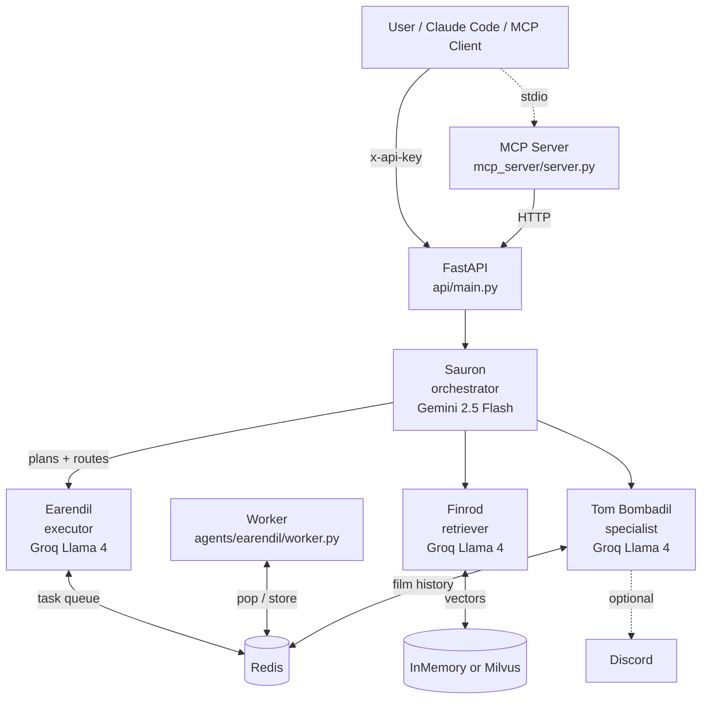

# ARDA

A four-agent system behind one FastAPI entry point. One unified codebase, one HTTP contract, one MCP surface — four named specialists doing the actual work. Tolkien-themed because the routing was getting confusing.



## The four agents

| Agent | Tier | Role | Default model |
|---|---|---|---|
| **Sauron** | `orchestrator` | Receives NL requests, classifies intent, dispatches to one specialist, returns the wrapped result. | `gemini-2.5-flash` |
| **Earendil** | `executor` | Plans + enqueues shell commands to a Redis-backed task queue. A separate worker process drains it and writes results back to Redis. | `meta-llama/llama-4-scout-17b-16e-instruct` (Groq) |
| **Finrod** | `retriever` | RAG. Ingests text, embeds, stores vectors, answers grounded queries. Falls back to in-memory store + hash-based embedder when Milvus / `sentence-transformers` are absent. | `meta-llama/llama-4-scout-17b-16e-instruct` (Groq) |
| **Tom Bombadil** | `specialist` | Discord film-club bot. Parses film notes (`Film: ... / Rating: ...`), persists to Redis, generates conversational replies. | `meta-llama/llama-4-scout-17b-16e-instruct` (Groq) |

`USE_MOCK_LLM=true` swaps every LLM for a deterministic templated `MockLLM`, so the system runs end-to-end with zero API keys for development. `USE_MOCK_EMBEDDER=true` opts into the hash-based embedder independently — useful on weak hosts where torch is too heavy.

## API

All routes require `X-API-Key: <ARDA_API_KEY>` except `/health`.

| Method | Path | Purpose |
|---|---|---|
| `GET` | `/health` | Liveness check (no auth). Returns `{status, agent, version}`. |
| `POST` | `/plan` | Run Sauron's planner only. Returns `{intent, subtasks}`. |
| `POST` | `/execute` | NL → plan → dispatch. Always returns a poll-able `task_id`. Shell intents enqueue to the worker queue; non-shell intents resolve via Sauron and persist the result to Redis under the same `task_id`. |
| `POST` | `/execute/wait` | Same as `/execute` but blocks until results land or `WAIT_TIMEOUT_SECONDS` (15s) elapses. |
| `POST` | `/execute/result` | Aggregate status across multiple `task_id`s. |
| `GET` | `/result/{task_id}` | Poll a single task's result from Redis. |
| `POST` | `/task` | Submit a structured task directly (`{type, action, payload}`). Bypasses Sauron. Used by the MCP `arda_execute` tool. |
| `POST` | `/agents/{name}/run` | Direct agent invocation. Bypasses Sauron entirely. |
| `GET` | `/agents/health` | Per-agent `HealthStatus` for all four agents. |
| `POST` | `/memory/ingest` | Push a document into Finrod's vector store. |
| `POST` | `/memory/query` | Semantic search + LLM synthesis. |
| `POST` | `/query` | Read-only Redis / system inspection. Returns the legacy six-key `system_status` shape the MCP server reads. |

### Example

```bash
ARDA_API_KEY=$(security find-generic-password -a arda -s arda-api-key -w)  # macOS
# or: export ARDA_API_KEY=...

curl -s http://100.112.3.116:5000/health
# {"status":"online","agent":"earendil","version":"0.3.0"}

curl -s -X POST http://100.112.3.116:5000/execute/wait \
  -H "x-api-key: $ARDA_API_KEY" -H "content-type: application/json" \
  -d '{"message":"uptime"}'
# {"status":"completed","results":[{"output":"03:31:40 up 28 days, ..."}], ...}

curl -s -X POST http://100.112.3.116:5000/memory/ingest \
  -H "x-api-key: $ARDA_API_KEY" -H "content-type: application/json" \
  -d '{"doc_id":"arda","text":"ARDA is a four-agent system. Sauron orchestrates."}'

curl -s -X POST http://100.112.3.116:5000/memory/query \
  -H "x-api-key: $ARDA_API_KEY" -H "content-type: application/json" \
  -d '{"message":"Who orchestrates in ARDA?"}'
# {"result":{"answer":"Sauron.", ...}}
```

## Run it

### Local dev (mock LLM, zero API keys)

```bash
python3.12 -m venv .venv && source .venv/bin/activate
pip install -e '.[dev]'
cp .env.example .env             # ships with USE_MOCK_LLM=true
pytest tests/ -v                 # 109 passing
uvicorn api.main:app --reload    # needs Redis on localhost:6379
```

### Docker (production)

```bash
cp .env.example .env
# edit .env: set USE_MOCK_LLM=false, GEMINI_API_KEY, GROQ_API_KEY, ARDA_API_KEY
docker compose up -d
curl http://localhost:5000/health
```

The default Docker image is intentionally slim: ~400MB, no `torch`, no `pymilvus`, no `pandas`. Finrod uses `MockEmbedder` + in-memory store. To get real semantic embeddings via `sentence-transformers/all-MiniLM-L6-v2` and a real Milvus deployment, edit the Dockerfile to `pip install -e '.[full]'` and set `USE_MOCK_EMBEDDER=false` + `MILVUS_HOST`.

See `docs/cutover.md` for the runbook used to deploy onto a host that's already running a legacy stack on port 5000.

## Repository layout

```
agents/         Four agent subpackages, one per agent
  base.py       BaseAgent ABC: tier, name, async run(), async health()
  _mock_llm.py  Drop-in LangChain Runnable for USE_MOCK_LLM=true
  sauron/       Orchestrator: agent.py + planner.py
  earendil/     Executor: agent.py + worker.py + context_trimmer.py
  finrod/       Retriever: agent.py + embeddings.py + ingest.py + store.py
  tombombadil/  Specialist: agent.py + bot.py + film_parser.py + ...

api/            Unified FastAPI server
  main.py       App factory + lifespan
  middleware/   X-API-Key auth
  routes/       health, tasks, agents, memory, query

core/           Shared foundation imported by every agent
  config.py     Pydantic Settings + model_router_by_tier
  redis_client.py / milvus_client.py
  models.py     AgentTask, AgentResult, TaskStatus, HealthStatus
  logging.py    structlog with trace-id injection

mcp_server/     FastMCP server exposing arda_execute / arda_plan /
                arda_query / arda_status as Claude Code tools

legacy_api/     Original earendil_api.py preserved as rollback artifact
docs/           ADRs + cutover runbook
tests/          pytest suite (109 passing, 1 integration skipped)
scripts/        dev.sh, ingest.py
```

## Cost model

Per call, monthly estimates assume ~200 orchestrator + ~600 specialist calls/day at ~1K tokens each.

| Tier | Provider / Model | Input $/M | Output $/M | Est. monthly |
|---|---|---|---|---|
| Orchestrator | Google Gemini 2.5 Flash | $0.30 | $1.00 | ~$2 |
| Executor / Retriever / Specialist | Groq Llama 4 Scout | $0.11 | $0.34 | ~$3 |
| Embeddings | `sentence-transformers/all-MiniLM-L6-v2` (local) | $0 | $0 | $0 |
| Embeddings (slim) | `MockEmbedder` (hash) | $0 | $0 | $0 |
| Dev / testing | `MockLLM` | $0 | $0 | $0 |

Real spend on the home-server deployment (mock embedder, real LLMs) is **<$10/mo** at single-user volume.

## Conventions

- Python 3.12+. `from __future__ import annotations` everywhere.
- LLM calls flow through `core.config.settings` and the `use_mock_llm` gate. Never construct `ChatGroq` / `ChatGoogleGenerativeAI` directly without checking the flag (see ADR 0003).
- Logging is `core.logging.get_logger(name)`. No `print()`, no `logging.basicConfig` in agent code.
- Redis access goes through `core.redis_client.get_redis_sync()` / `get_redis_async()`. Never construct `redis.Redis(...)` inline.
- Decisions worth recording become numbered ADRs in `docs/decisions/`. Existing ADRs are immutable — supersede or amend with a new ADR that references the old one.

## Build phases

1. **Foundation** — `core/`, `agents/base.py`, `pyproject.toml`. **Done.**
2. **Agents** — migrate Earendil + Tom Bombadil, build Sauron + Finrod. **Done.**
3. **Unified API** — `api/main.py` + routers + auth. **Done.**
4. **Infrastructure** — Docker Compose, ingest script, HTTP tests. **Done.**
5. **Polish** — README, Mermaid, cost model, v1.0.0. **Done.**

Full scope: [`ARDA_SCOPE.md`](ARDA_SCOPE.md). Decisions: [`docs/decisions/`](docs/decisions/). Cutover runbook: [`docs/cutover.md`](docs/cutover.md).
