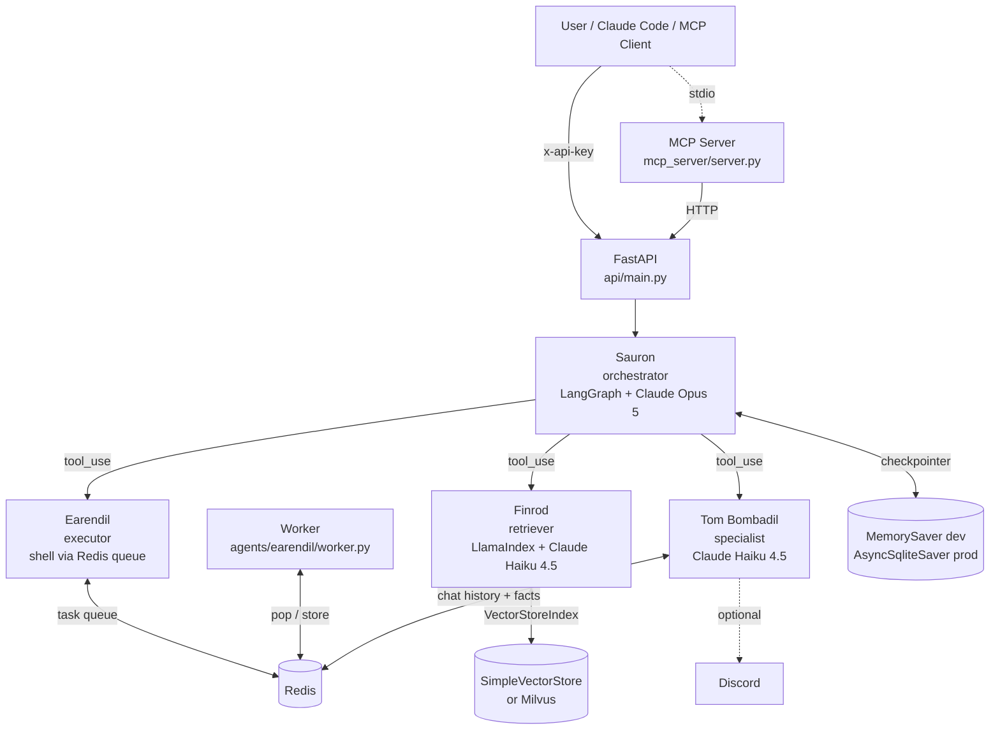

# ARDA

  

A multi-agent system behind one FastAPI entry point. One unified codebase, one HTTP contract, one MCP surface, Tolkien-named specialists doing the work. The orchestrator (Sauron) is a real LangGraph `StateGraph` that drives the agent loop with native Anthropic `tool_use` blocks; each specialist is a tool, the graph runs them, the result is the response.



## The agents

| Agent | Tier | Role | Default model |
|---|---|---|---|
| **Sauron** | `orchestrator` | LangGraph `StateGraph`: classifies intent via Claude's tool_use, dispatches to one specialist as a tool call, loops until Claude emits a terminal `text` block. Cross-turn memory via the checkpointer keyed by `thread_id`. | `claude-opus-5` |
| **Earendil** | `executor` | Plans + enqueues shell commands to a Redis-backed task queue. A separate worker process drains it and writes results back to Redis. No LLM in the agent itself — regex-based plan_task. | n/a |
| **Finrod** | `retriever` | RAG via LlamaIndex `VectorStoreIndex`. Default in-memory `SimpleVectorStore`; `MilvusVectorStore` under the `[full]` extra. LLM + embed model + vector store are constructor-injected. | `claude-haiku-4-5-20251001` |
| **Tom Bombadil** | `specialist` | Discord film-club bot. Conversational chat via Anthropic SDK directly; rule-based fact extractor + Finrod-backed long-term memory; reaction-confirmed note drafts. | `claude-haiku-4-5-20251001` |
| **Galadriel** | infra | Cron scheduler + worker. Calls the unified API for watch-party reminders and Letterboxd sync jobs. | n/a |
| **Gwaihir** | infra | Telegram ops bot. Sends/receives messages on an allowlisted chat ID. | n/a |

`USE_MOCK_LLM=true` (the default) swaps every LLM for a deterministic mock — `MockAnthropicClient` for Sauron's tool_use loop, `MockAnthropicChatClient` for Tom Bombadil's chat, LlamaIndex `MockLLM` for Finrod. The test suite runs end-to-end with **zero API keys**. `USE_MOCK_EMBEDDER=true` opts into LlamaIndex `MockEmbedding` independently, so you can flip on real LLM calls without paying the ~1GB torch + sentence-transformers footprint.

## API

All routes require `X-API-Key: <ARDA_API_KEY>` except `/health` and `/metrics`.

| Method | Path | Purpose |
|---|---|---|
| `GET` | `/health` | Liveness check (no auth). Returns `{status, agent, version}`. |
| `GET` | `/metrics` | Prometheus scrape (no auth). |
| `POST` | `/plan` | Run the regex planner only. Returns `{intent, subtasks}`. |
| `POST` | `/execute` | NL → plan → dispatch. Always returns a poll-able `task_id`. Shell intents enqueue to the worker queue; non-shell intents resolve via Sauron and persist the result to Redis under the same `task_id`. |
| `POST` | `/execute/wait` | Same as `/execute` but blocks until results land or `WAIT_TIMEOUT_SECONDS` (15s) elapses. |
| `POST` | `/execute/result` | Aggregate status across multiple `task_id`s. |
| `GET` | `/result/{task_id}` | Poll a single task's result from Redis. |
| `POST` | `/task` | Submit a structured task directly (`{type, action, payload}`). Bypasses Sauron. Used by the MCP `arda_execute` tool. |
| `POST` | `/agents/{name}/run` | Direct agent invocation. Bypasses Sauron entirely. |
| `GET` | `/agents/health` | Per-agent `HealthStatus`. |
| `POST` | `/memory/ingest` | Push a document into Finrod's vector store. |
| `POST` | `/memory/query` | Semantic search + LLM synthesis. |
| `POST` | `/query` | Read-only Redis / system inspection. Returns the legacy six-key `system_status` shape the MCP server reads. |
| `POST` | `/cron`, `GET` `/cron`, `GET` `/cron/{id}`, `DELETE` `/cron/{id}` | Galadriel job management. |

### Example

```bash
export ARDA_API_KEY=arda-dev-key-2026   # default; override in .env for prod

curl -s http://localhost:5000/health
# {"status":"online","agent":"earendil","version":"0.3.0"}

curl -s -X POST http://localhost:5000/execute/wait \
  -H "x-api-key: $ARDA_API_KEY" -H "content-type: application/json" \
  -d '{"message":"uptime"}'
# {"status":"completed","results":[{"output":"03:31:40 up 28 days, ..."}], ...}

curl -s -X POST http://localhost:5000/memory/ingest \
  -H "x-api-key: $ARDA_API_KEY" -H "content-type: application/json" \
  -d '{"doc_id":"arda","text":"ARDA is a multi-agent system. Sauron orchestrates via LangGraph."}'

curl -s -X POST http://localhost:5000/memory/query \
  -H "x-api-key: $ARDA_API_KEY" -H "content-type: application/json" \
  -d '{"message":"Who orchestrates in ARDA?"}'
# {"result":{"answer":"Sauron.", ...}}
```

## Run it

### Local dev (mock LLM, zero API keys)

```bash
uv sync --extra dev                # Python 3.12, slim install (~5s, no torch)
cp .env.example .env               # ships with USE_MOCK_LLM=true
uv run pytest tests/ -q            # full suite, no network
uv run uvicorn api.main:app        # needs Redis on localhost:6379
```

### Docker (production)

```bash
cp .env.example .env
# edit .env: set USE_MOCK_LLM=false, ANTHROPIC_API_KEY, ARDA_API_KEY
docker compose up -d
curl http://localhost:5000/health
```

The default Docker image is intentionally slim: no `torch`, no `pymilvus`, no `sentence-transformers`. Finrod uses `MockEmbedding` + the in-memory `SimpleVectorStore` by default. To get real semantic embeddings via `sentence-transformers/all-MiniLM-L6-v2` and Milvus, install with the `[full]` extra (`uv sync --extra dev --extra full`) and set `USE_MOCK_EMBEDDER=false` + `MILVUS_HOST`.

See `docs/cutover.md` for the deployment runbook.

## Repository layout

```
agents/             One package per agent
  base.py           BaseAgent ABC: tier, name, async run(), async health()
  conduct.py        Shared CONDUCT_PROMPT used by Tom Bombadil's system message
  _anthropic_mock.py    Anthropic-shaped mocks (tool_use + chat-only)
  _llama_index_mock.py  Deterministic hash-embedding for Finrod tests
  sauron/           Orchestrator: agent.py + graph.py + state.py +
                    tools.py + llm.py + planner.py (regex /plan helper)
  earendil/         Executor: agent.py + worker.py + context_trimmer.py
  finrod/           Retriever: agent.py + embeddings.py + store.py + llm.py
  tombombadil/      Specialist: agent.py + bot.py + commands.py +
                    fact_extractor.py + memory.py + draft_store.py +
                    film_knowledge.py + identity.py + ... (Discord, Letterboxd)
  galadriel/        Cron scheduler + worker
  gwaihir/          Telegram ops bot

api/                Unified FastAPI server
  main.py           App factory + lifespan + _make_checkpointer
  middleware/       X-API-Key auth
  routes/           health, tasks, agents, memory, query, cron

core/               Shared foundation imported by every agent
  config.py         Pydantic Settings + per-tier model/provider routing
  redis_client.py   Sync + async Redis singletons; task_queue keys
  milvus_client.py  Optional pymilvus connection helper ([full] only)
  models.py         AgentTask, AgentResult, TaskStatus, HealthStatus
  logging.py        structlog with trace-id injection

mcp_server/         FastMCP server exposing arda_execute / arda_plan /
                    arda_query / arda_status as Claude Code tools,
                    wired to the unified api/main.py over HTTP

docs/               ADRs + cutover runbook + Tom Bombadil specs
tests/              pytest suite -- mock-by-default, runs without keys
scripts/            dev.sh, ingest.py, ingest_brain_db.py
.github/workflows/  CI: uv + ruff + pytest on every PR
```

## Cost model

Anthropic is the only LLM provider:

| Tier | Default model | Volume | Notes |
|---|---|---|---|
| Orchestrator (Sauron) | `claude-opus-5` | ~1 call per user message | Tool-calling loop; usually 2-3 round trips per request |
| Retriever (Finrod) | `claude-haiku-4-5-20251001` | per `/memory/query` call | Synthesis only; retrieval is local |
| Specialist (Tom Bombadil) | `claude-haiku-4-5-20251001` | per Discord turn | Conversational chat |
| Executor (Earendil) | n/a | — | Regex planner, no LLM |
| Embeddings | `MockEmbedding` (slim) / `sentence-transformers/all-MiniLM-L6-v2` ([full]) | local | $0 either way |
| Dev / testing | All mocks | local | $0 |

See [Anthropic pricing](https://docs.anthropic.com/en/docs/about-claude/pricing) for current rates. The slim test path uses zero external calls.

## Conventions

- Python 3.12+, `from __future__ import annotations` everywhere.
- LLM calls flow through each agent's `llm.py` factory (`agents/sauron/llm.py`, `agents/finrod/llm.py`, `agents/tombombadil/llm.py`) which honors `USE_MOCK_LLM`. Never construct an Anthropic client inline.
- The `BaseAgent.run(AgentTask) -> AgentResult` contract is load-bearing — Sauron's tool_dispatch, the `/agents/{name}/run` route, and the e2e tests all depend on the result envelope shape.
- LlamaIndex's `Settings` global is **never** mutated — Finrod passes `llm`/`embed_model` explicitly to `VectorStoreIndex` so concurrent test instances stay isolated.
- Logging is `core.logging.get_logger(name)`. No `print()`, no `logging.basicConfig` in agent code.
- Redis access goes through `core.redis_client.get_redis_sync()` / `get_redis_async()`. Never construct `redis.Redis(...)` inline.
- Ruff is authoritative (`E,F,I,B,UP,N,SIM`, line length 100). CI runs `ruff check .` + `pytest tests/ -q` on every PR.
- Decisions worth recording become numbered ADRs in `docs/decisions/`. Existing ADRs are immutable; supersede or amend with a new ADR referencing the old one.

## Build history

1. **Foundation** (`core/`, `agents/base.py`, slim install).
2. **Agents** — initial Earendil + Tom Bombadil, then Sauron + Finrod scaffolded.
3. **Unified API** (`api/main.py` + routers + auth) + MCP rewire onto the unified API.
4. **Architecture pivot to provider SDKs + LangGraph patterns** (2026):
   - Sauron rebuilt as a real LangGraph `StateGraph` with native Anthropic tool_use and a durable checkpointer (`#7`, `#33`).
   - Finrod migrated to LlamaIndex (`VectorStoreIndex` + injectable components) (`#35`).
   - Tom Bombadil moved off `langchain-groq` onto the anthropic SDK directly (`#38`).
   - Dead LangChain-anthropic intent classifier + orphaned Groq/Gemini config removed (`#39`).

Full scope: [`ARDA_SCOPE.md`](ARDA_SCOPE.md). Decisions: [`docs/decisions/`](docs/decisions/). Cutover runbook: [`docs/cutover.md`](docs/cutover.md). Agent guidance for Claude Code: [`CLAUDE.md`](CLAUDE.md).
